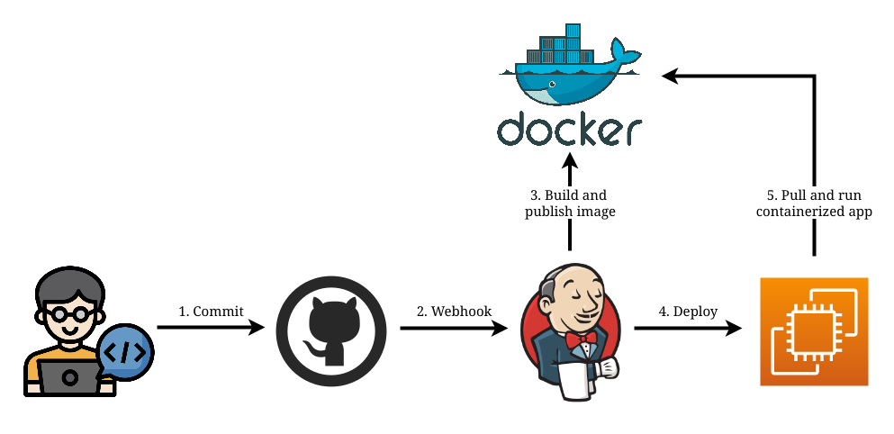

# simple-terraform-ansible-infrastructure
This repository provides the necessary code to provision two EC2 instances on AWS, serving distinct purposes. One instance is dedicated to functioning as the Jenkins server, while the other serves as the application server

Pipeline

